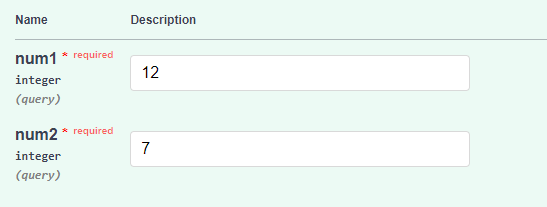
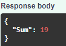

# Documentation for the Homework

This is the documentation for the homework. The task was to make a simple web application that uses a machine learning model to give the prediction of chosen domain.

## Used model:

- ### [DETR](https://huggingface.co/facebook/detr-resnet-50) - Object detection model made by Facebook AI.

## Used Libraries:

- ### [Gradio](https://www.gradio.app/) - A library that allows to create a web application for applications easily.
- ### [PyTorch](https://pytorch.org/) - A library that is used for machine learning and deep learning.
- ### [Pillow](https://pillow.readthedocs.io/en/stable/) - A library that is used for image processing.

## Installation:

To install the required libraries, run the following command:

```bash
pip install -r requirements.txt
```

## Usage:

To deploy the site, download the files "requirements.txt, main.py, venv", save them, and write the command in the terminal:

1. python -m venv venv (I can't upload this file to GitHub)
2. If you are on Windows: .\venv\Scripts\activate
   If you are on MacOS then: source venv/bin/activate
   And to deploy the site: uvicorn main:app --reload.
   after which you can enter numbers and see their sum

## Input/Output:

The input is two numbers and the output is the sum of two numbers

## Example of input/output:

# input:



#output:

