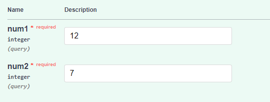
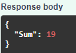

# Documentation for the Homework

This is the documentation for the homework. The task was to make a simple web application that uses a machine learning model to give the prediction of chosen domain.

## Used model:

- ### [DETR](https://huggingface.co/facebook/detr-resnet-50) - Object detection model made by Facebook AI.

## Used Libraries:

- ### [Gradio](https://www.gradio.app/) - A library that allows to create a web application for applications easily.
- ### [PyTorch](https://pytorch.org/) - A library that is used for machine learning and deep learning.
- ### [Pillow](https://pillow.readthedocs.io/en/stable/) - A library that is used for image processing.

## Installation:

Install the dock and run the following commands to start:

1. Build Docker: docker build -t my-fastapi-app .
2. Run it: docker run -d --name my-fastapi-container -p 8000:8000 my-fastapi-app

## Input/Output:

The input is two numbers and the output is the sum of two numbers

## Example of input/output:

# input:

# output:

